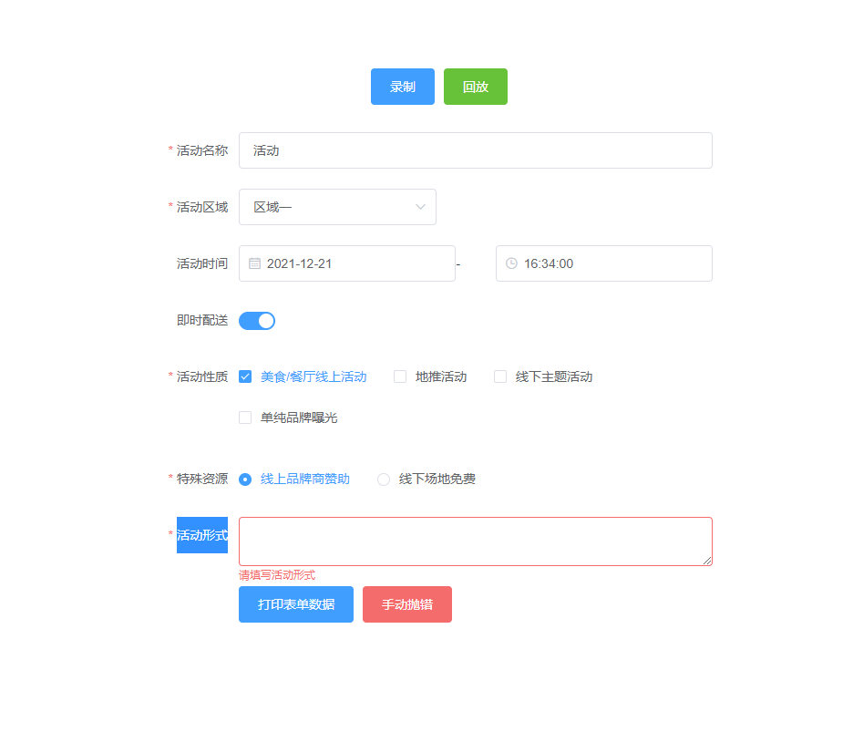
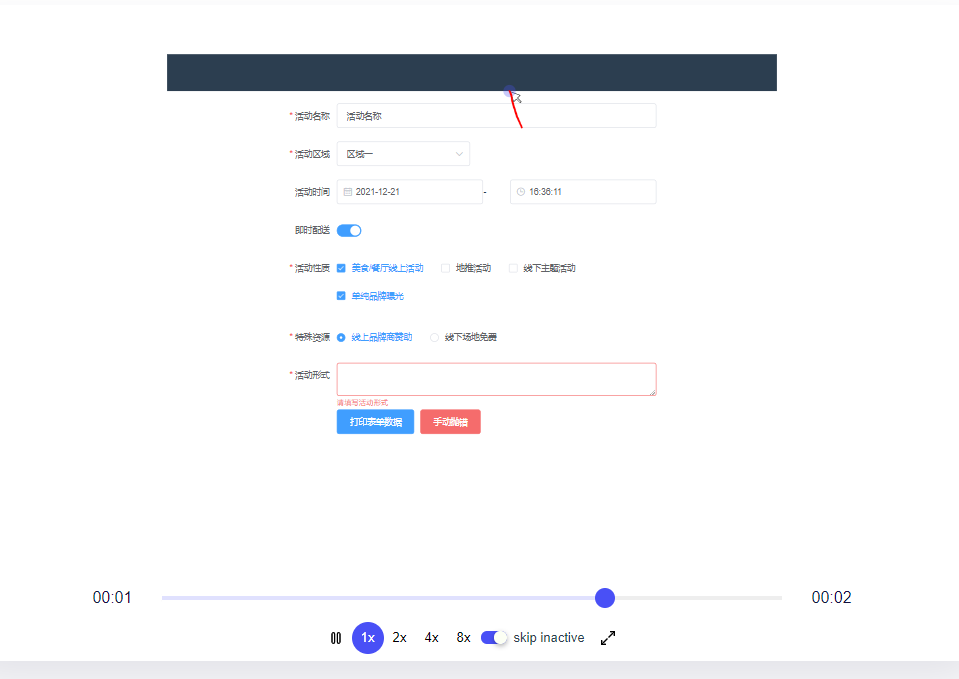
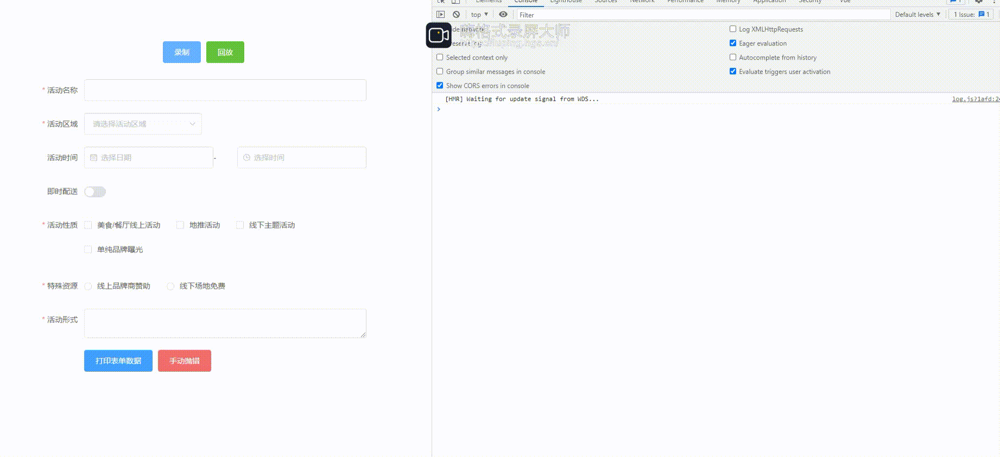

# rrweb实现前端错误监控和用户行为回放

[rrweb](https://www.rrweb.io/) 是 'record and replay the web' 的简写，旨在利用现代浏览器所提供的强大 API 录制并回放任意 web 界面中的用户操作。

用文字描述总是显得不够直观，我们直接看来看一个经典的 [俄罗斯方块](https://www.rrweb.io/demo/tetris/?lan=zh) 游戏。这个例子中直接将用户的操作的游戏行为给记录下来并生成了界面“回放”。看到这里的同学们是否觉得很炫酷？其实刚才我们看到的并不是一个视频回放，而是通过将 DOM 对象序列化之后保存在内存中实现了快照的记录，并且在回放的时候我们会一次性拿到完整的快照链，并且将这些快照依次同步执行就实现了刚才我们看到的这个例子的效果了。

**所以刚才讲的一系列对前端同学有什么帮助呢？**

其实我们可以换个场景思考一下：假如你负责一个 B 端项目，在上了生产之后用户反馈出现了bug。这个时候用户和你说了一大堆问题，但是你又无法重现问题，更不能登录客户的账号来复现问题（是不是很焦急？），那么这个时候你就可以通过这个方案来处理了。

# rrweb 目前使用的场景

### 录制与回放

录制与回放是最常用的使用方式，适用于任何需要采集用户行为数据并重新查看的场景。

### 异步加载数据

当录制的数据较多时，一次性加载至回放页面可能带来较大的网络开销和较长的等待时间。这时可以采取数据分页的方式，异步地加载数据并回放。

### 实时回放（直播）

如果希望持续、实时地看到录制的数据，达到类似直播的效果，则可以使用实时回放 API。这个方式也适用于一些实时协同的场景。

### 回放时与 UI 交互

回放时的 UI 默认不可交互，但在特定场景下也可以通过 API 允许用户与回放场景进行交互。

### 转换为视频

rrweb 录制的数据是一种高效、易于压缩的文本格式，可以用于像素级的回放。但如果有进一步将录制数据转换为视频的需求，同样可以通过一些工具实现。

### Canvas

Canvas 是一种特殊的 HTML 元素，默认情况下其内容不会被 rrweb 观测。我们可以通过特定的配置让 rrweb 能够录制并回放 Canvas。

### console 录制和播放

这个功能旨在为开发者提供更多的 bug 信息。对这项功能我们还提供了一些设置选项。（从 v1.0.0 版本开始支持）

# rrweb项目结构

rrweb 主要由 3 部分组成：

- **[rrweb-snapshot](https://github.com/rrweb-io/rrweb/tree/master/packages/rrweb-snapshot/)**，包含 snapshot 和 rebuild 两个功能。snapshot 用于将 DOM 及其状态转化为可序列化的数据结构并添加唯一标识；rebuild 则是将 snapshot 记录的数据结构重建为对应的 DOM。
- **[rrweb](https://github.com/rrweb-io/rrweb)**，包含 record 和 replay 两个功能。record 用于记录 DOM 中的所有变更（mutation）；replay 则是将记录的变更按照对应的时间一一重放。
- **[rrweb-player](https://github.com/rrweb-io/rrweb/tree/master/packages/rrweb-player/)**，为 rrweb 提供一套 UI 控件，提供基于 GUI 的暂停、快进、拖拽至任意时间点播放等功能。

# 一个 vue 项目中的示例

先来看一个界面截图：

在这个示例中我模拟了如下场景：

1. 有一个表单可以用来收集用户输入
2. 模拟了用户点击某个按钮之后代码报错的一个 log 信息收集
3. 回放用户操作表单的时候报错之前发生了什么行为。

接下来我们做一些填写表单的操作：

1. 点击录制按钮开始收集event事件
2. 先在表单随便输入一些内容
3. 分别点击“打印表单数据”、“手动抛错” 触发控制台输入log
4. 最后点击“回放”按钮查看演示

回放截图：

最后通过一个动图来展示下效果：

最后附上本次演示项目地址 [github](https://github.com/JZH189/rrweb-demo.git)
